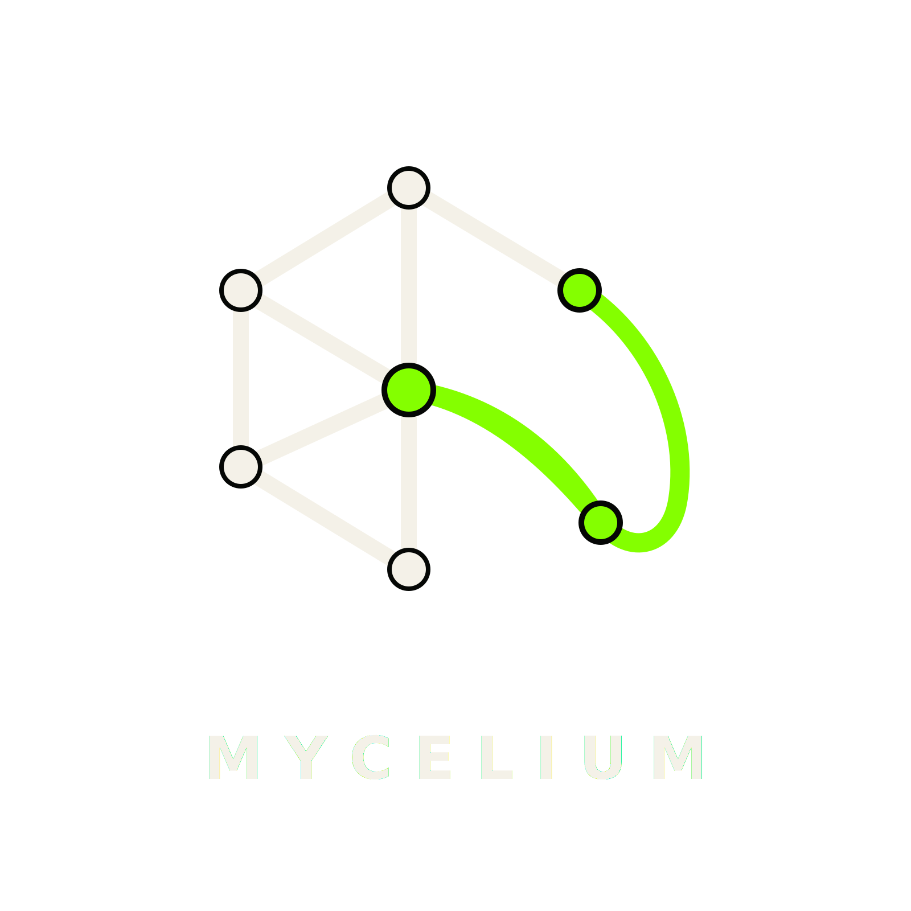

<!--
Copyright © 2026 mindicator & silicon bags quartet.
SPDX-License-Identifier: AGPL-3.0-or-later
This file is part of Mycelium, licensed under the GNU Affero General Public License v3.0 or
later. See the LICENSE file in the repository root.
-->

  

# Mycelium

  
  
  
  
  

> 🇬🇧 Resilient private connectivity over unreliable networks. · 🇨🇳 在不可靠网络上提供有韧性的私有连接。 · 🇮🇳 अविश्वसनीय नेटवर्कों पर सुदृढ़ निजी कनेक्टिविटी। · 🇪🇸 Conectividad privada y resiliente sobre redes poco fiables. · 🇸🇦 اتصال خاص ومرن عبر الشبكات غير الموثوقة. · 🇫🇷 Connectivité privée et résiliente sur des réseaux peu fiables. · 🇷🇺 Устойчивая приватная связь поверх ненадёжных сетей. · 🇵🇹 Conectividade privada e resiliente sobre redes não confiáveis. · 🇮🇩 Konektivitas privat yang tangguh di jaringan tak andal. · 🇩🇪 Robuste private Konnektivität über unzuverlässige Netze. · 🇯🇵 不安定なネットワーク上での回復力あるプライベート接続。 · 🇹🇷 Güvenilmez ağlar üzerinde dayanıklı, özel bağlantı. · 🇰🇷 불안정한 네트워크에서도 견고한 프라이빗 연결. · 🇮🇷 اتصال خصوصیِ پایدار روی شبکه‌های نامطمئن.

> [!IMPORTANT]
> **Use restriction.** Mycelium is licensed for educational, research, humanitarian, and civil use
> only. Use for military operations, covert surveillance, or illegal activities is prohibited. See
> [ACCEPTABLE-USE.md](ACCEPTABLE-USE.md).

---

## What this is

Mycelium is a **persistent, self-adapting private network (PPN)** — server software: a mesh of
relay nodes that coordinate and reroute to keep private connectivity available across unreliable,
high-interference, and disaster-prone networks. It is an information layer that helps households,
people, and organizations keep reliable, private control of their own connectivity. The path runs
from a single multi-protocol node that adapts to network interference automatically, to a
decentralized mesh of nodes that agree among themselves and reroute on their own. The end property:
private connectivity stays available wherever there is some channel to the network and at least one
working node within reach.

This is community infrastructure: an engineering and disaster-resilience project that leads with
unreliable networks — outages, congestion, packet loss, and interference — of which restrictive
networks are one case.

> **Scope.** This is *server-side* software. Nodes expose **standard protocol endpoints** consumed
> by existing off-the-shelf clients; a bespoke end-user client is **out of scope** for now.

> [!IMPORTANT]
> **Software, not an operated network — separation statement.**
>
> The repository publishes server-side software.
> It does not operate a public network.
> It does not publish public endpoints.
> It does not distribute public client configs.
> Each operator independently deploys and controls their own node.

## Who it's for

Mycelium is built for the people and groups who need dependable private connectivity when networks
are unreliable:

- **Communities & community infrastructure** keeping a neighbourhood or local segment connected.
- **Researchers** who need stable, measurable access to the wider network.
- **Journalists** working over restrictive or congested links.
- **NGOs** operating in disaster-prone or high-interference environments.
- **Families** who want private, reliable control of their own connectivity.
- **Distributed & remote teams** that depend on a connection holding through outages.
- **Infrastructure operators** running and extending mesh segments.

## The mycelial model

Mycelium grows and heals like its namesake: useful behaviour emerges from many small, local
decisions rather than from a central plan.

- **Hyphae explore** — each node spends a small, bounded budget probing peers, transports, and paths.
- **Anastomoses connect** — independent local paths fuse when doing so improves resilience.
- **Cords carry** — paths that prove repeatedly useful are promoted into temporary high-capacity corridors.
- **Gradients guide** — growth is biased toward where connectivity is actually needed.
- **Stress leaves memory** — failures reshape future routing, without exposing users.
- **Dead paths decay** — unused or unverified topology expires on its own.
- **Spores germinate** — small signed artifacts carry bootstrap/route/trust information across any
  carrier, surviving disconnection and restarting reachability.
- **Local signals build global structure** — no node needs the whole map to improve the network.

When one path dies, traffic re-forms around it across other nodes. Any carrier that can move
authenticated bytes — IP, cellular, satellite, Wi-Fi Direct, Bluetooth, LoRa-style radio, or even a
file/QR hand-off — can act as a bridge (see
[docs/adr/0011-carrier-agnostic-bridging.md](docs/adr/0011-carrier-agnostic-bridging.md)).

## Core concepts & components

| Term | What it is |
|---|---|
| **PPN** | Persistent private network — the system as a whole: a self-adapting mesh that keeps private connectivity available. |
| **Node** | A server that participates in the mesh: terminates transports, relays traffic, and (later) coordinates. |
| **Link** | An authenticated connection between two nodes. |
| **Cord** | A temporary, reversible high-capacity corridor promoted from links that prove repeatedly useful. |
| **Spore** | A compact, signed, TTL-bounded portable artifact (bootstrap hint, route capsule, trust invitation, revocation, manifest, stress digest) that can travel over any carrier. |
| **Carrier / bridge** | Any medium that can move authenticated bytes; described by a capability + risk descriptor, not a separate protocol. |
| **Gradient** | A measured bias (demand, scarcity, trust) that steers where the mesh grows. |
| **Stress memory** | A privacy-preserving record of failures that improves future routing. |
| **Adaptation layer** | The control plane that measures conditions and adjusts transports and paths. |
| **Discovery / membership** | How nodes find one another and who may join, with sybil-resistance. |

Full term list: [docs/GLOSSARY.md](docs/GLOSSARY.md). Architecture layers and the transport matrix:
[docs/ARCHITECTURE.md](docs/ARCHITECTURE.md).

## Documentation

**Concept & design**
- **[AGENTS.md](AGENTS.md)** — operating doctrine for AI agents working in this repo.
- **[docs/vision/0001-mycelium-vision-and-scope.md](docs/vision/0001-mycelium-vision-and-scope.md)** — founding vision and scope.
- **[docs/vision/0002-carrier-agnostic-mycelial-doctrine.md](docs/vision/0002-carrier-agnostic-mycelial-doctrine.md)** — carrier-agnostic mycelial doctrine.
- **[docs/vision/0005-network-weather-explorer.md](docs/vision/0005-network-weather-explorer.md)** — public, privacy-preserving network-weather explorer (aggregated, not a map).
- **[docs/ROADMAP.md](docs/ROADMAP.md)** — phases 0→7, scope, Definition of Done, risks.
- **[docs/ARCHITECTURE.md](docs/ARCHITECTURE.md)** — layers, transport matrix, carrier adapters, mesh design, stack.
- **[docs/THREAT-MODEL.md](docs/THREAT-MODEL.md)** — adversary, attack surface, honest limits.
- **[docs/GLOSSARY.md](docs/GLOSSARY.md)** — terminology.

**Governance & legal**
- **[TRADEMARKS.md](TRADEMARKS.md)** — the name and shared-identity marks (governed separately from the code; the project does not operate a public network).
- **[ACCEPTABLE-USE.md](ACCEPTABLE-USE.md)** — acceptable use of the shared name, marks, and trust roots (not of an operated network).
- **[GOVERNANCE.md](GOVERNANCE.md)** — community/consensus governance of the shared identity and trust roots.

**Operations & security**
- **[SECURITY.md](SECURITY.md)** — security policy & coordinated disclosure.
- **[docs/dependency-policy.md](docs/dependency-policy.md)** — supply-chain & dependencies.

**Engineering process**
- **[docs/development.md](docs/development.md)** — engineering charter: standards, layers, git workflow, tests, CI gates.
- **[docs/refactoring.md](docs/refactoring.md)** — audit & refactoring policy (Expert-Lens, severities S0–S3).
- **[docs/contributing.md](docs/contributing.md)** — how to contribute; commit template — [docs/commit-template.txt](docs/commit-template.txt).

**Catalogues** (numbering `NNNN-<slug>.md`, each with its own README)
- **[docs/adr/](docs/adr/)** — Architecture Decision Records (decisions).
- **[docs/proposals/](docs/proposals/)** — Refactoring/Change Proposals (work).
- **[docs/audits/](docs/audits/)** — audit reports (Expert-Lens, findings).
- **[docs/vision/](docs/vision/)** · **[docs/research/](docs/research/)** · **[docs/runbooks/](docs/runbooks/)** · **[docs/templates/](docs/templates/)**

## Status

**Phase 0 — Foundation (landed):** the deploy-ready node scaffold — multi-protocol data plane
(sing-box + AmneziaWG), control tooling, provisioning (Ansible), observability, conformance tests,
and runbooks.

**Phase 1 — Distribution & on-device validation (closed):** genuine-TLS transports, a typed and
self-replenishing endpoint bundle, and a self-updating subscription — validated hands-on over real
cellular and Wi-Fi links.

**Phase 2 — Adaptation layer (in progress):** the control plane that *measures and adapts* — a
deterministic network-state detector, a reinforce-and-decay self-tuner, and a node-local
auto-rotation loop that moves the active transport off a degraded path within rate limits, with
anti-flapping and automatic rollback. In parallel the control logic is consolidating into a typed Go
spine — *the shell renders and deploys; the Go binary decides and adapts.*

The scaffold is deploy-ready for any operator to self-host on their own server; the project itself
runs no public network. The roadmap spans phases 0→7; each phase is useful on its own and ships to
production, and the mesh is extended on top of something already working, not instead of it.

## Principles

1. **No custom cryptography or transports.** Build on Xray/sing-box, AmneziaWG, libp2p, and proven
   patterns. Innovation lives in the adaptation and orchestration layers — see
   [docs/adr/0002-no-custom-cryptography.md](docs/adr/0002-no-custom-cryptography.md).
2. **Indistinguishability over obfuscation.** The goal is not "a hidden tunnel" but being
   statistically like legitimate HTTPS/QUIC.
3. **Redundancy by default.** Multiple protocols, ports, SNI values, IPs, ASes, and carriers at once.
4. **Degrade, don't fail.** Losing a node or coordinator slows the network down; it does not switch
   it off.
5. **Operator and user safety is requirement #1.** Legal posture and opsec are designed in from
   phase 0, not bolted on later.

## Governance & licensing

The **code** is free software under the GNU AGPL-3.0-or-later (see [LICENSE](LICENSE)). You may run,
study, modify, and redistribute it; if you run a modified version as a network service, you must make
your changes available to its users under the same license.

The repository does **not** operate a public network. It publishes no public endpoints and
distributes no public client configs; each operator independently deploys and controls their own
node. What is governed **separately** (not under the AGPL) is the project's **shared identity** —
the **Mycelium name, logo, bootstrap seeds, trust roots, and spore-signing keys** — see
[TRADEMARKS.md](TRADEMARKS.md), [ACCEPTABLE-USE.md](ACCEPTABLE-USE.md), and
[GOVERNANCE.md](GOVERNANCE.md). That identity is **community-owned**: there is no single owner, and
from Phase 1–2 onward decisions move to community/organization **consensus** ("fungi voting"), not a
single person. A fork is welcome but must use its own name and may not present itself as carrying the
shared Mycelium identity. Commercial allies (small hosts, NGOs, university spin-offs, cooperatives,
security auditors, emergency-connectivity providers) are welcome under those terms.

## Long-term horizon

A community-run peer-to-peer connectivity layer is a distant aspiration, conceivable only after the
mesh is fully decentralized. It is **out of scope** for the current work and noted here only as a
direction, not a promise.
